# Icônes Form Widget  🪄 🎉 🎊
Access thousands of SVG icons as a backend form widget.

One library, over **100,000** vector icons, Modern replacement for icon fonts. Fast, easy to use.

- **108+** icon sets powered by [Iconify](https://iconify.design/)
- Browse the icons on [Iconify](https://icon-sets.iconify.design/) or on [Icônes](https://icones.netlify.app/)
  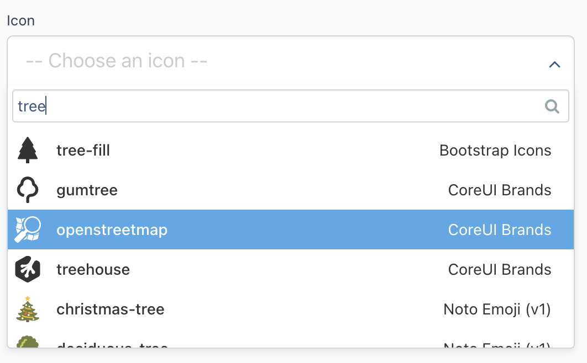

## Advantages of this form widget
Every time I use icon fonts, end users don't find them appealing, or even they don't find what they want.
Styling was challenging, with SVG icons you can apply classes and style them as you want.

There are many excellent icon sets available, some are available only as fonts and almost all of them load entire set even if you are displaying just few icons.

Icônes combines all those icon sets (more than 100) that makes it possible to use many icons from different icon sets on same page or in same application using one form widget.

Icônes combines pixel perfect rendering of SVG with ease of use of glyph fonts, while offering more choice than any glyph font.

You don't need to load any dependency at all.

You can use Font Awesome, Material Design Icons, Unicons, Dashicons, Emoji, ... and many other icon sets on same page or application using one form widget.

## Installation
Simply install the plugin from the marketplace or clone the repository [https://github.com/chkilel/icones-plugin](https://github.com/chkilel/icones-plugin) from GitHub into the plugins folder.

## How to use
Icones registers a new backend form widget named `iconesfinder`.

You can access the Form Widget in your model's fields.yaml file or as **Custom Page Fields** for [static pages](https://github.com/rainlab/pages-plugin/blob/master/docs/documentation.md#custom-page-fields) by using `iconesfinder` as the field type.

- Usage example via yaml config:

```yaml
    my_awesome_icon:
        label: My super awesome icon
        type: iconesfinder
        showName: true
        showIconSetName: true
        size: large
        placeholder: -- Choose your icon --
        iconSets: # Icon sets to choose from, the icon sets must be enabled in the settings area
            - mdi # Material Design Icons
            - ant-design # Ant Design Icons
            - emojione # Emoji One (Colored)
            - logos # SVG Logos
```

- Usage example via Custom page fields for [Pages plugin](https://github.com/rainlab/pages-plugin/blob/master/docs/documentation.md#custom-page-fields):

```
    {variable   type="iconesfinder"
                name="my_awesome_icon"
                label="My awesome icon"
                showName="true"
                showIconSetName="true"
                size="large"
                iconSets="mdi|ant-design|emojione|logos|pages"
                placeholder="My placeholder"
                tab="My tab name"
                placement="secondary"
    }{/variable}
```

>
> Please pay attention to the spaces for **Custom Page Fields**, there is no space between
> the **option**, the **equal sign** `=` and the **value**

## Field Options
For each field you can specify these options:

Option | Description| Default if not set
------------- | ------------- | --------------
**showName** |**Optional**: Show the name of the **icon** beside the SVG in the field. Options: true, false.| true
**showIconSetName** |**Optional**: Show the name of the **icon set** beside the SVG in the field. Options: true, false.| true
**iconSets** |**Optional**: (abbreviated name of the icon set) <br> Define the icon sets to choose from, the icon sets must be enable in the setting area. see ([available icon sets](#Icon set name)) bellow for available options. <br> *If it's not set, the user can choose from all enabled icon sets.*| All enabled icon sets in the settings area
**size** | **Optional**: Specifies the field size. Options: small, large.| Normal size
**placeholder** |**Optional**: The text to show when nothing is selected.| -- Choose an icon --  <br/>Translated string.


### Form field widget `showName` option

Show the name of the icon in the field.

Value | Appearance
------------- | -------------
true | 
false | 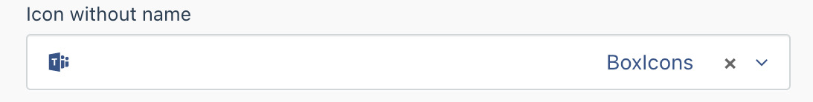


### Form field widget `showIconSetName` option

Show the name of the icon set in the field.

Value | Appearance
------------- | -------------
true | 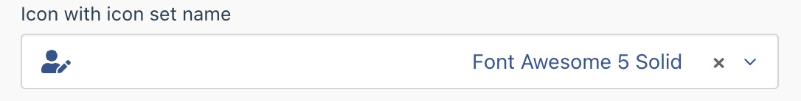
false | 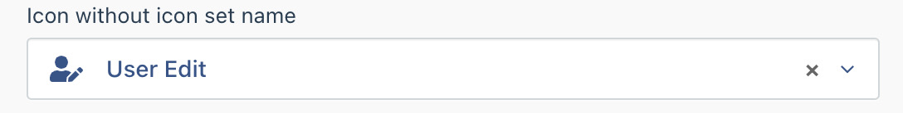


### Form field widget `size` option

Set the size of the field.

Value | Appearance
------------- | -------------
small | 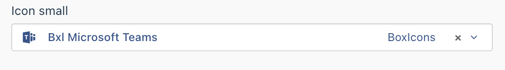
(Defaul if not set) | 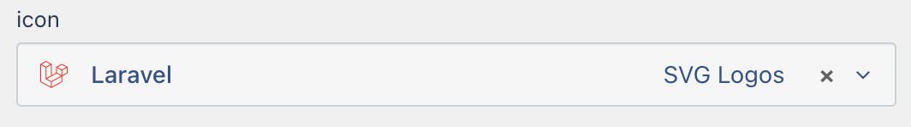
large | 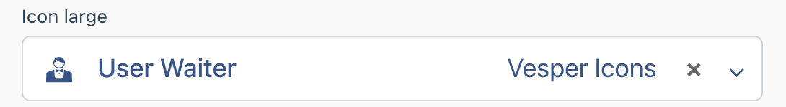


### Form field widget `iconSets` option

For `iconSets` option, you can choose one or more from the possible values below, if not set, the user can choose from all enabled icon sets in the backend settings:

Possible values |Icon set real name |Total icons
------------- | ------------- | --------------
akar-icons|Akar Icons|363
ant-design|Ant Design Icons|788
bi|Bootstrap Icons|1386
bpmn|BPMN|112
brandico|Brandico Font|45
bx|BoxIcons|1525
bytesize|Bytesize Icons|101
carbon|Carbon|1840
ci|coolicons|412
cib|CoreUI Brands|830
cif|CoreUI Flags|199
cil|CoreUI Free|554
clarity|Clarity|1096
codicon|Codicons|374
cryptocurrency|Cryptocurrency Icons|471
dashicons|Dashicons|343
ei|Evil Icons|70
el|Elusive Icons|304
emojione|Emoji One (Colored)|1834
emojione-monotone|Emoji One (Monotone)|1403
emojione-v1|Emoji One (v1)|1262
entypo|Entypo+|321
entypo-social|Entypo+ Social|76
eos-icons|EOS Icons|239
et|Elegant|100
eva|Eva Icons|490
fa|Font Awesome 4|678
fa-brands|Font Awesome 5 Brands|457
fa-regular|Font Awesome 5 Regular|151
fa-solid|Font Awesome 5 Solid|1001
fad|FontAudio|155
fe|Feather Icon|255
feather|Feather Icons|286
file-icons|File Icons|929
flat-color-icons|Flat Color Icons|329
flat-ui|Flat UI Icons|100
fluent|Fluent UI System Icons|8566
fontelico|Fontelico|34
fontisto|Fontisto|615
foundation|Foundation|283
fxemoji|Firefox OS Emoji|1034
geo|GeoGlyphs|30
gg|css.gg|704
gis|Font-GIS|336
gridicons|Gridicons|201
grommet-icons|Grommet Icons|614
healthicons|Health Icons|1485
heroicons-outline|HeroIcons Outline|230
heroicons-solid|HeroIcons Solid|230
ic|Google Material Icons|9520
icomoon-free|IcoMoon Free|491
icon-park|IconPark|2422
icon-park-outline|IconPark Outline|2422
iconoir|Iconoir|941
icons8|Icons8 Windows 10 Icons|234
il|Icalicons|84
ion|IonIcons|1332
iwwa|Innowatio Font|105
jam|Jam Icons|940
la|Line Awesome|1544
line-md|Material Line Icons|250
logos|SVG Logos|1236
ls|Ligature Symbols|348
lucide|Lucide|491
majesticons|Majesticons|420
maki|Maki|204
map|Map Icons|167
mdi|Material Design Icons|6031
mdi-light|Material Design Light|267
medical-icon|Medical Icons|144
mi|Mono Icons|180
mono-icons|Mono Icons|180
noto|Noto Emoji|3310
noto-v1|Noto Emoji (v1)|2157
octicon|Octicons|454
oi|Open Iconic|223
openmoji|OpenMoji|3914
pepicons|Pepicons|316
ph|Phosphor|5206
pixelarticons|Pixelarticons|460
ps|PrestaShop Icons|479
radix-icons|Radix Icons|297
raphael|Raphael|266
ri|Remix Icon|2271
si-glyph|SmartIcons Glyph|800
simple-icons|Simple Icons|1992
simple-line-icons|Simple line icons|189
subway|Subway Icon Set|306
system-uicons|System UIcons|420
tabler|Tabler Icons|1298
teenyicons|Teenyicons|1200
topcoat|TopCoat Icons|89
twemoji|Twitter Emoji|3556
typcn|Typicons|336
uil|Unicons|1206
uim|Unicons Monochrome|296
uis|Unicons Solid|189
uit|Unicons Thin Line|214
uiw|uiw icons|214
vaadin|Vaadin Icons|636
vs|Vesper Icons|159
vscode-icons|VSCode Icons|1084
websymbol|Web Symbols Liga|85
whh|WebHostingHub Glyphs|2125
wi|Weather Icons|228
wpf|Icons8 Windows 8 Icons|200
zmdi|Material Design Iconic Font|777
zondicons|Zondicons|297
<span>| **Total icons for all icon sets**|**102 443**


# Settings
After installation, go to `Backend > Settings >icones` or type **icones** in the search field.

Initially, none of the icon sets is installed, you need to install the icon sets you want to allow the end user to use.

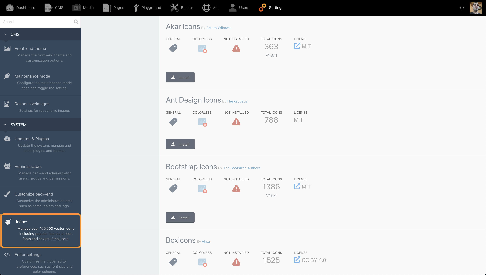


- You can enable installed icon sets:


- Disable enabled ones:

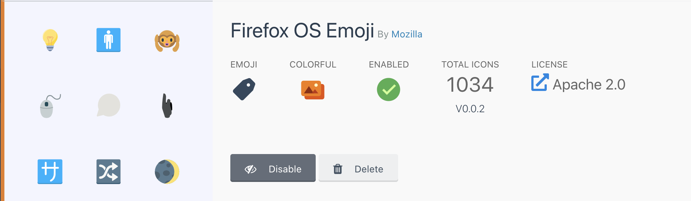


- Or completely delete an icon set.


> Please note that to delete an icon set, you need to disable it first.

 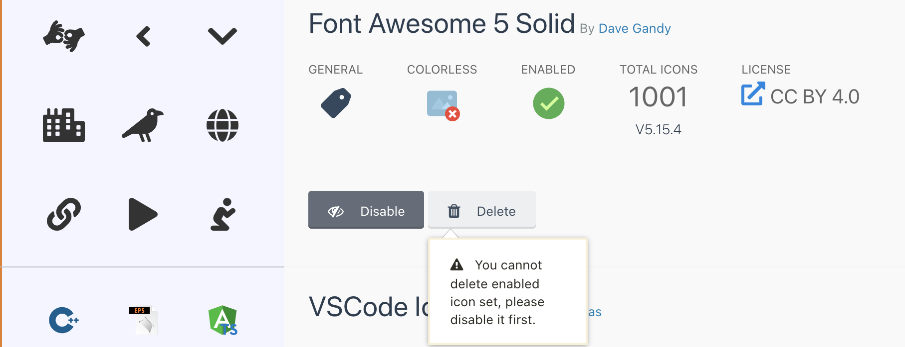


## Permissions

The plugin registers two backend permissions to manage Icônes.
- **Access Icônes settings** : allow the user to enable and/or disable icon sets.
- **Manage icon sets installation end deletion** : allow the user to install and/or delete icon sets.

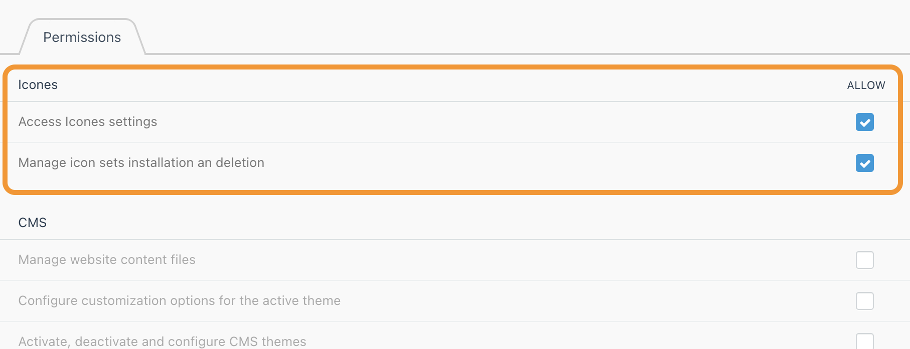


## Usage in Twig template

Icônes plugin register a new filter `iconify()` to use in your templates, the filter generate an SVG icon.

### Twig filter options

`iconify` filter optionally accept an object with `key:value` paires to generate the SVG.
It will use default if used as `{{ my_var|iconify }}` without providing any parameter,
The options to use are listed below.

Examples of usages:
```twig
    {{ my_var|iconify }} {# Default options from stored value #}


    {{ my_var|iconify({'height': '24px', 'class':'w-10 h-10' }) }}


    {{ my_var | iconify({
                    'height' : '24px',
                    'width' : '24px',
                    'align' : 'center,middle,meet',
                    'color' : '#ff8000',
                    'rotate' : '90deg', // same as "'rotate' =>  1" or "'rotate' => '25%'"
                    'flip' : 'horizontal', // same as "'hFlip' => true"
                    'box' : true
                 });
       }}


   {#  Height and width will be set from viewBox attribute, using original icon's dimensions#}
   {{ my_var | iconify({ 'height' => 'auto'}) }}

```
#### options
Key | Description | Default | Options
--- | --- | --- | ---
class | The css class to apply to the svg tag |  | CSS class to apply
width, height | Dimensions of icon. If only one attribute is set, another attribute will be set using icon's width/height ratio. If value is "auto", icon's original dimensions will be used. If both width and height are not set, height defaults to "1em". | "1em" | String such as "1em", "24px" or number.
hFlip, vFlip | Flip icon horizontally and/or vertically. | false | true or "true" or "1" (string or boolean),
flip | Alternative to "hFlip" and "vFlip" |  | String, value can be "horizontal", "vertical" or "horizontal,vertical"
rotate | Rotation. |  | Value can be in degrees "90deg" (only 90, 180 and 270 rotations are available), percentages "25%" (25%, 50% and 75% are aliases of 90deg, 180deg and 270deg) or number 1-3 (1 - 90deg, 2 - 180deg, 3 - 270deg).
inline | If true, code will include vertical-align style, making it behave like a glyph. | false | true or "true" or "1" (string or boolean),
color | custom color string to replace currentColor. This is useful when using icon as background image because background image cannot use currentColor |  |
box | If true, icon will include extra rectangle matching its view box. | false | true or "true" or "1" (string or boolean)
align | Alignment. This is useful if you have custom width and height set. <br>Unlike other images, SVG keep aspect ratio (unless stated otherwise) when scaled. Value is comma or space separated string with possible strings <br>(example: "left,top,crop"): |  | - left, right, center - horizontal alignment <br>- top, middle, bottom - vertical alignment <br>- crop - crop parts that go outside of boundaries <br>- meet - scale icon down to fit entire icon (opposite of crop)


## Usage in PHP

The icônes plugin value can also be used easily in PHP, with the obove options as follows:

```php
use Chkilel\Icones\Classes\JsonIcon;

$icon = new JsonIcon($value);
$icon->iconify(['inline'=>true, 'height'=>36]);

```

## Usage in Backend List

The icônes plugin can also be used on backend lists, it defines a new Column Types `iconesthumb` with the option to give a **height** (in px) to the output, e.g.

```yaml
icon:
    label: My awesome icon
    type: iconesthumb
    height: 36
```

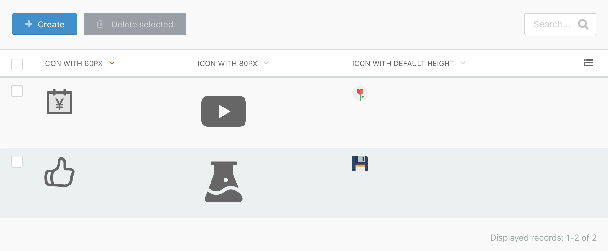

